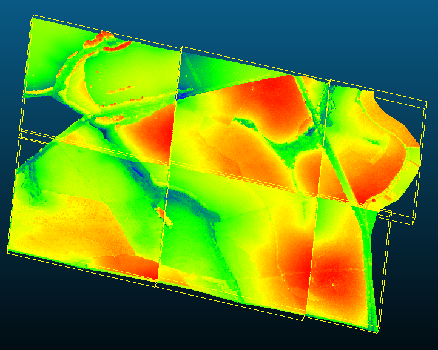

```{r setup, include=FALSE}
library(tidyverse)
library(sf)
library(tidyterra)
library(terra)
library(stars)
library(tools)
library(RColorBrewer)
library(progress)
library(reshape2)
library(mapview)
library(lidR)
library(RCSF)
library(future)
```

```{r, echo=FALSE, fig.align='center', out.width="40%"}
knitr::include_graphics("IMAGES/CAPA.png")
```

\centerline {Piracicaba, SP – Data de Emissão: `r format(Sys.Date(), '%d de %B de %Y')`}
\newpage


\tableofcontents


\newpage
# Pacotes utilizados no R (colocar breve descrição - já tem uma descriçãozinha no R passado em aula)
## Tidyverse
## Sf
## Tidyterra
## Terra
## Stars
## Tools
## RColorBrewer
## Progress
## Reshape2
## Mapview
## LidR
## RCSF
## Future

\newpage
<!-- localização da área, nuvem LiDAR e mapa -->
# Descrição da área 
A área a ser estudada como "Fazenda Modelo" localiza-se no município de São Miguel Arcanjo (SP), pode ser identificada pelas coordenadas (-23.86707°,  -47.87772°) e possui 129,784 ha, que dividem-se em 4 subtalhões: 301a (18,933 ha), 301d (34,468 ha), 302a (47,602 ha) e 302c (28,781 ha).

```{r, echo=FALSE, fig.cap='Mapa da propriedade', fig.align='center', out.width="60%"}
knitr::include_graphics("IMAGES/mapafazendamodelo.png")
```
```{r, echo=FALSE, fig.cap='Nuvens LiDAR normalizadas', fig.align='center', out.width="40%", fig.show='hold'}
knitr::include_graphics(c("IMAGES/nuvensnormalizadas.png","IMAGES/nuvensnormalizadaszoom.png"))
```
<!-- Imagem das feições selecionadas, colocar dados no QGiS -->
\newpage
# Grid e parcelas já inventariadas 
A região foi dividida em 3454 parcelas, onde 2960 delas possuem 400m², enquanto as outras são menores por estarem na borda e abrangerem áreas além da área de interesse. Além disso, 13 das parcelas possuem dados de inventário florestal e podem ser identificadas pelos seguintes Id's: 993, 1526, 1770, 1881, 3165, 3628, 3660, 3730, 5052, 5091, 5106 e 5122.
```{r, echo=FALSE, fig.cap='Parcelas com dados de inventário', fig.align='center', out.width="40%"}
knitr::include_graphics("IMAGES/parcelasinventariadas.png")
```
\newpage
# Fluxograma e etapas Dupla amostragem

``` {r, echo=FALSE, fig.cap='Fluxograma das etapas de processamento de dados LiDAR para fins de inventário florestal', fig.align='center', out.width = "80%"}
knitr::include_graphics("IMAGES/fluxogramaDA.png")
```
1. Carregamento dos pacotes
  i. Diversos são os pacotes carregados. Os nomes e a utilidade de cada um estão descritos na primeira seção do documento.
2. Definição das pastas e local de trabalho
3. Definição das funções para criação dos gráficos
4. Definição das equações (estudar quais são)
5. Download dos dados
  i. Ao todo foram baixadas 6 nuvens de pontos LiDAR, que antes do processamento encontravam-se da seguinte maneira: (preciso trocar essas imagens pq elas foram coloridas separadamente)  
  
``` {r, echo=FALSE, fig.cap='Nuvens de pontos LiDAR pré-processadas', fig.align='center', out.width = "40%"}

```

6. Leitura dos dados LiDAR
7. Leitura dos dados em Shapefile  

``` {r, echo=FALSE, fig.cap='Dados contidos nas parcelas inventariadas', fig.align='center', out.width = "50%"}
knitr::include_graphics("IMAGES/atributosinventariadas.png")
```

8. Clipagem da nuvem para eliminação de dados indesejados
9. Classificação
10. Normalização
11. Recorte da nuvem em tiles 300x300m
12. Cálculo de métricas para cada voxel
13. Seleção de um grupo de métricas para estudo de correlação
14. Análise da correlação por meio de gráfico
15. Determinação do modelo de predição
16. Criação de mapas raster e gráficos

# Fluxograma e etapas Tripla amostragem