```{r setup, include=FALSE}
library(tidyverse)
library(sf)
library(tidyterra)
library(terra)
library(stars)
library(tools)
library(RColorBrewer)
library(progress)
library(reshape2)
library(mapview)
library(lidR)
library(RCSF)
library(future)
```

```{r, echo=FALSE, fig.align='center', out.width="40%"}
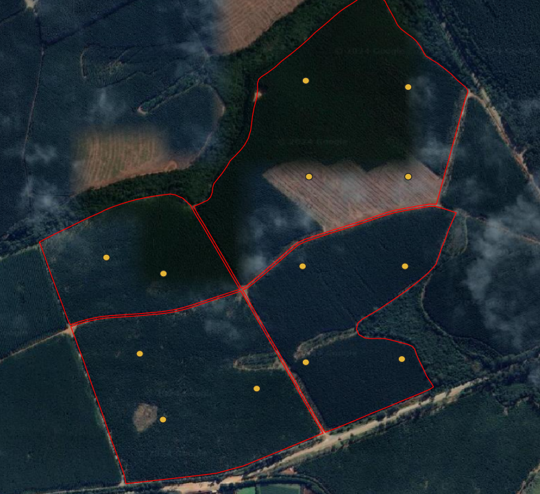
```

\centerline {Piracicaba, SP – Data de Emissão: `r format(Sys.Date(), '%d de %B de %Y')`}
\newpage


\tableofcontents


\newpage
# Pacotes utilizados no R (colocar breve descrição - já tem uma descriçãozinha no R passado em aula)
## Tidyverse (https://livro.curso-r.com/4-2-tidyverse.html)

O Tidyverse é um pacote guarda-chuva e contém diversas funções úteis para garantir o dinamismo no script, visualização, processamento e análise dos dados, modelagem etc. 

```{r, echo=FALSE, fig.cap='Tidyverse', fig.align='center', out.width="60%"}
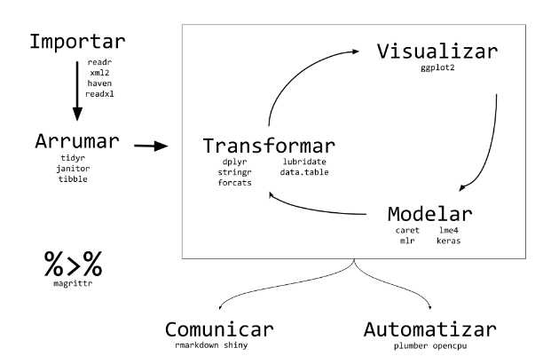
```

## Sf

Pacote utilizado para manipulação de objetos do mundo real. Descreve a forma com que esses objetos podem ser armazenados e importados e quais operações geométricas podem ser definidas por eles. 

## Tidyterra
## Terra
## Stars
## Tools
## RColorBrewer
## Progress
## Reshape2
## Mapview
## LidR
## RCSF
## Future

\newpage
<!-- localização da área, nuvem LiDAR e mapa -->
# Descrição da área 
A área a ser estudada como "Fazenda Modelo" localiza-se no município de São Miguel Arcanjo (SP), pode ser identificada pelas coordenadas (-23.86707°,  -47.87772°) e possui 129,784 ha, que dividem-se em 4 subtalhões: 301a (18,933 ha), 301d (34,468 ha), 302a (47,602 ha) e 302c (28,781 ha).

```{r, echo=FALSE, fig.cap='Mapa da propriedade', fig.align='center', out.width="60%"}
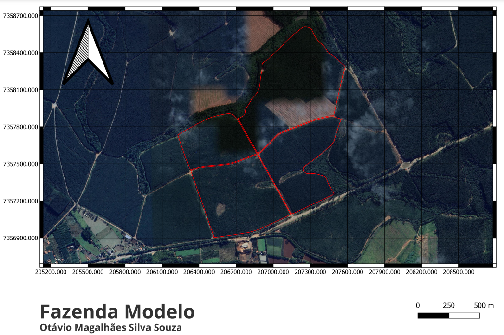
```
```{r, echo=FALSE, fig.cap='Nuvens LiDAR normalizadas', fig.align='center', out.width="40%", fig.show='hold'}
knitr::include_graphics(c("IMAGES/nuvensnormalizadas.png","IMAGES/nuvensnormalizadaszoom.png"))
```
<!-- Imagem das feições selecionadas, colocar dados no QGiS -->
\newpage
# Grid e parcelas já inventariadas 
A região foi dividida em 3454 parcelas, onde 2960 delas possuem 400m², enquanto as outras são menores por estarem na borda e abrangerem áreas além da área de interesse. Além disso, 13 das parcelas possuem dados de inventário florestal e podem ser identificadas pelos seguintes Id's: 993, 1526, 1770, 1881, 3165, 3628, 3660, 3730, 5052, 5091, 5106 e 5122.
```{r, echo=FALSE, fig.cap='Parcelas com dados de inventário', fig.align='center', out.width="40%"}
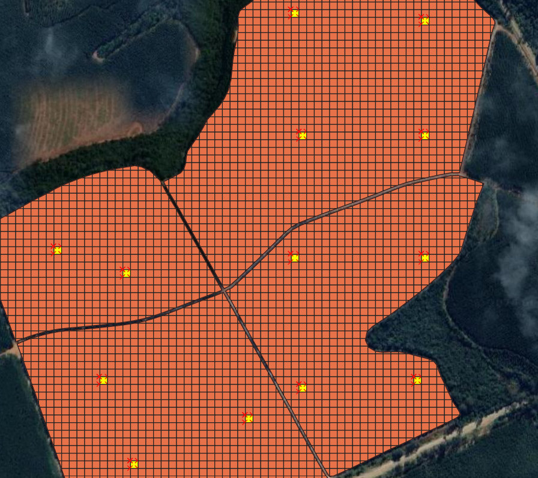
```
\newpage
# Conceitos e definições da Dupla Amostragem  

A dupla amostragem é composta por duas fases (s1 e s2)
- s1: compreende uma gama de variáveis explanatórias para cada ponto pertencente a s1. As variáveis explanatórias derivam de informações auxiliares disponíveis em grande quantidade ao longo da área florestal;  
- s2: constitui o inventário terrestre feito num número limitado de subamostras, onde todas pertencem à s1 e fornecem o valor das variáveis de interesse, ex. densidade local.  

Exemplo prático e definições (https://www.ipef.br/publicacoes/scientia/nr108/cap09.pdf)  
- O erro amostral (E%) é calculado a partir do desvio padrão S², que representa a variação de uma série de médias retiradas da população  
- A dupla amostragem se divide em duas fases. Na primeira fase há uma maior intensidade amostral e se é medida a variável auxiliar, que deve ser de mensuração facilitada. Na segunda fase a intensidade amostral é menor e se mede a variável de interesse e a variável auxiliar, pois será calculado um estimador de regressão entre as duas. (existe uma diferença entre estimadores de regressão e de razão - estudar)  
- A alta correlação entre métricas LiDAR e parâmetros biofísicos da floresta justificam a adoção da tecnologia na primeira fase da DA, além de reduzir a intensidade amostra (custo e trabalho)
- Primeira fase: lançamento das parcelas e sobrevôo com o LiDAR  
- Etapas (2a fase): mensuração de variáveis das árvores (ex. DAP), medição de algumas árvores para gerar modelo hipsométrico, que será usado para descobrir a altura das outras árvores, cálculo do volume também por modelo e extrapolação do volume da parcela.  
- O estimador de regressão (estudar) do VTCC deve relacionar a(s) variável(eis) auxiliar(es) e também compreende a outros índices (constantes para cada região)  
- O desvio padrão, intervalo de confiança etc são feitos depois  

``` {r, echo=FALSE, fig.cap='Fluxograma DA e estimador de regressão para VTCC', fig.show='hold', fig.align='center', out.width = "45%"}
knitr::include_graphics(c("IMAGES/fluxograma-da-lidar-e-campo.jpg","IMAGES/eq-estimador-regressao.png"))
```

# Fluxograma e etapas Dupla amostragem  

``` {r, echo=FALSE, fig.cap='Fluxograma das etapas de processamento de dados LiDAR para fins de inventário florestal', fig.align='center', out.width = "80%"}
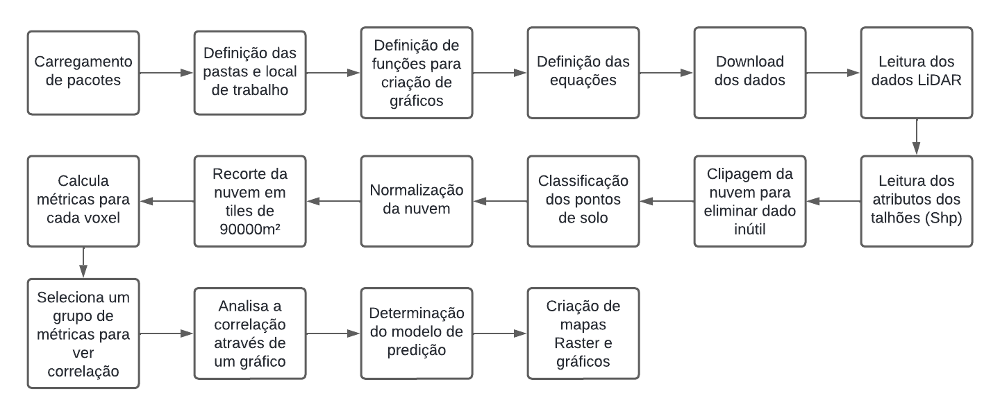
```

1. Carregamento dos pacotes
  i. Diversos são os pacotes carregados. Os nomes e a utilidade de cada um estão descritos na primeira seção do documento.
\newpage
2. Definição das pastas e local de trabalho  

* GitHub
  i. C: - pasta raiz
  ii. GitRepo - diretório em que estão agrupados os arquivos a serem upados no GitHub
  iii. PRJ_FAZENDAMODELO - pasta do projeto
  iv. RMD - código e arquivos utilizados na redação do presente documento
  v. RESULTADOS - plot da matriz de correlação
  vi. BATCHR - arquivo tipo R com os scripts utilizados no pré e pós-processamento dos dados
  vii. SAIDASSIG - arquivos gerados no QGIS
  viii. SHAPES - arquivos de entrada para uso no SIG  
  
* LiDAR 
  i. C: - pasta raiz
  ii. LiDAR - agrupa todos as nuvens de pontos utilizadas no script
  iii. PRJ_FAZENDAMODELO - pasta do projeto
  iv. NUVENS - onde se localizam as nuvens de pontos
  v. A13 - reúne as nuvens do ano de 2013
  vi. TALHOES - nuvem segregada por talhão
  vii. NoNORM - nuvens com solo classificado
  viii. SiNORM - nuvens com solo classificado e normalizadas
  ix. RSTR_qua - raster apresentando a estimativa da variável de interesse para cada talhão
  
``` {r, echo=FALSE, fig.cap='Organização dos diretórios', fig.align='center', out.width = "80%"}
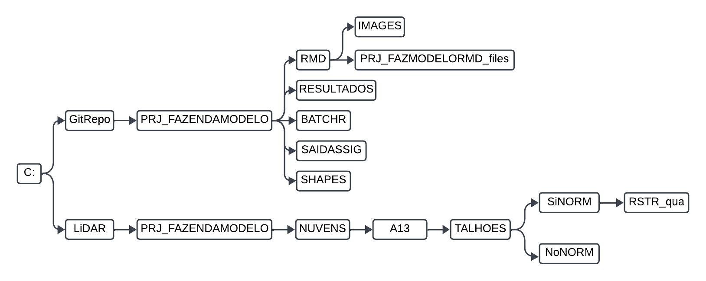
```

\newpage  

3. Definição das funções para criação dos gráficos  

\newpage  

4. Definição das equações (estudar quais são)  

\newpage  

5. Download e leitura dos dados LiDAR
  i. Ao todo foram baixadas 6 nuvens de pontos LiDAR, que antes do processamento encontravam-se da seguinte maneira:  
  
``` {r, echo=FALSE, fig.cap='Nuvens de pontos LiDAR pré-processadas', fig.align='center', out.width = "40%"}
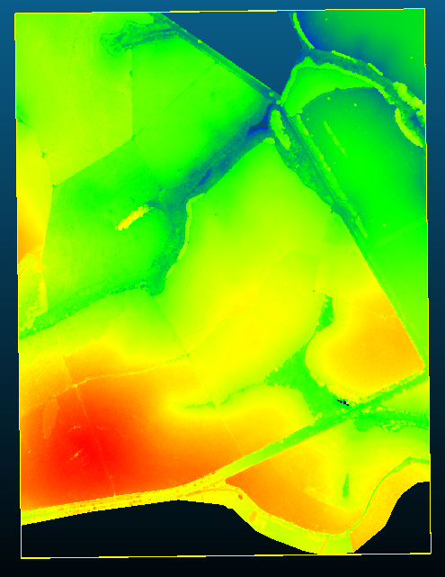
```

  ii. As nuvens foram baixadas pelo seguinte link: https://github.com/FlorestaR/dados/blob/main/5_LIDARF/Modelo/CLOUDS/

  
\newpage
6. Download e leitura dos dados em Shapefile  
  i. Os shapes foram baixados pelo seguinte link: https://github.com/FlorestaR/dados/blob/main/5_LIDARF/Modelo/SHAPES
  
``` {r, echo=FALSE, fig.cap='Dados contidos nas parcelas inventariadas', fig.align='center', out.width = "50%"}
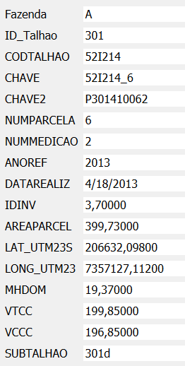
```

\newpage
7. Clipagem da nuvem para eliminação de dados indesejados (mostrar nuvem antes e depois)  
Antes da clipagem: 68mi pontos  
Após clipagem: 18mi pontos

``` {r, echo=FALSE, fig.cap='Comparativo entre as nuvens de pontos antes e após a clipagem', fig.align='center', out.width = "40%", fig.show='hold'}
knitr::include_graphics(c("IMAGES/pre-clipagem-passo8.png","IMAGES/pos-clipagem-passo8.png"))
```

\newpage
8. Classificação

``` {r, echo=FALSE, fig.cap='Processamento e resultado da classificação de solo das nuvens LiDAR', fig.align='center', out.width = "40%", fig.show='hold'}
knitr::include_graphics(c("IMAGES/classificacao-pontos-de-solo.png","IMAGES/nuvem-com-pontos-de-solo-classificados-mas-sem-normalizacao.png"))
```
\newpage
9. Normalização
  i. A etapa de normalização tem por finalidade nivelar toda a nuvem e é um passo que está diretamente correlacionado à classificação do solo.

``` {r, echo=FALSE, fig.cap='Resultado da normalização das nuvens', fig.align='center', fig.show='hold', out.width = "40%"}
knitr::include_graphics(c("IMAGES/nuvensnormalizadas.png","IMAGES/nivelamento.png"))
```
\newpage
10. Recorte da nuvem em tiles 300x300m
  O recorte da nuvem em tiles menores tme a função de facilitar o processamento dos dados, tornando-o mais rápido e dinâmico

``` {r, echo=FALSE, fig.cap='Retile da nuvem em quadrados de 300x300m', fig.align='center', out.width = "50%"}
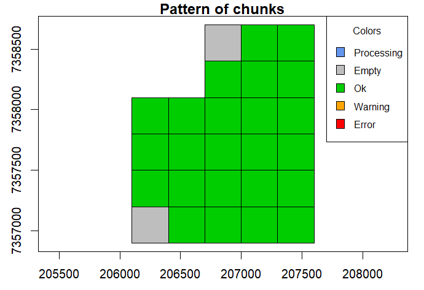
```
\newpage

11. Cálculo de métricas para cada voxel (explicar voxel)

``` {r, echo=FALSE, fig.cap='Cálculo das métricas para cada voxel', fig.align='center', out.width = "50%"}
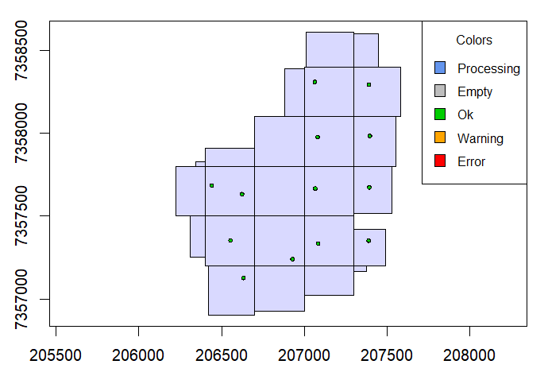
```
\newpage
12. Seleção de um grupo de métricas para estudo de correlação

``` {r, echo=FALSE, fig.cap='Tabela com as métricas escolhidas', fig.align='center', out.width = "50%"}
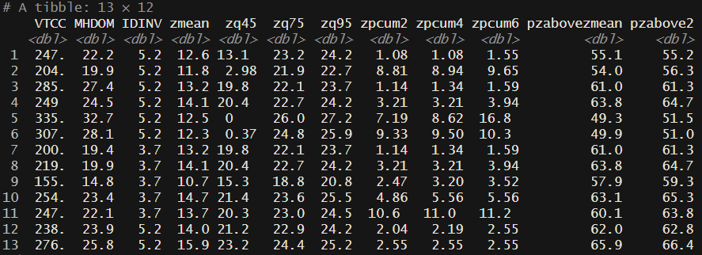
```
\newpage
13. Análise da correlação por meio de gráfico (falar do gráfico)

``` {r, echo=FALSE, fig.cap='Resultado da análise de correlação', fig.align='center', out.width = "50%"}
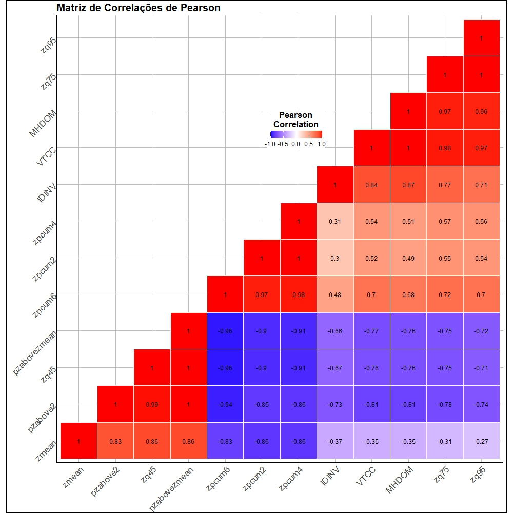
```
\newpage
14. Determinação do modelo de predição

``` {r, echo=FALSE, fig.cap='nao sei', fig.align='center', out.width = "50%"}
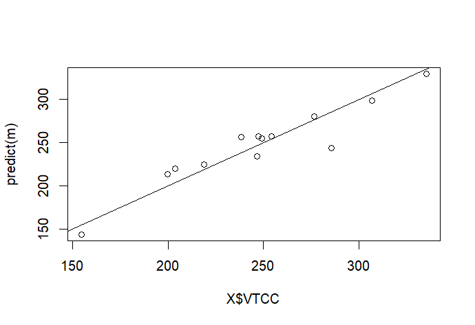
```
\newpage
15. Criação de mapas raster e gráficos
\newpage

# Fluxograma e etapas Tripla amostragem

Composta por 3 fases, s0, s1 e s2:  
- O princípio básico é o de que as variáveis explanatórias derivadas das informações auxiliares estão disponíveis em duas frequências diferentes. A fase s0 fornece informações sobre toda a área, enquanto s1 possui dados adicionais de amostras de s0. Logo, a partir da informação terrestre coletada de um número x de parcelas de campo (1 camada de informação) é possível aferir sobre informações adicionais para outras parcelas a partir do uso de preditores (2 camadas de informação) e, por fim, o LiDAR coleta dados sobre todas as parcelas (3 camadas de informação).  
- Logo, a motivação por trás da TA é a de que a gama de informações de s1 adiciona alto poder preditivo às variáveis disponíveis para todas as parcelas da área (s0)  

``` {r, echo=FALSE, fig.cap='Esquema TA com Lidar', fig.align='center', out.width = "50%"}
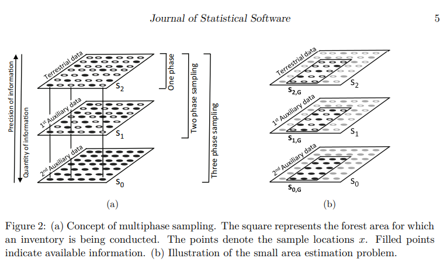
```

Estimativas de pequenas áreas (small area estimation)  
- Para sub áreas da floresta onde há pouca informação terrestre, como em G na figura acima. Para essas áreas, o uso da amostragem multifásica pode ser mais eficiente, já que utilizam um número reduzido de parcelas em campo para chegar à mesma precisão da ACE e ACS. Por outro lado, a sub área em questão pode ser pequena demais para justificar a adoção de um modelo de regressão separado, uma vez que este pode resultar em um intervalo de confiança indesejadamente abrangente;  
- A ideia, então, é a de utilizar toda a riqueza de informações presente nas amostras de S2 para ajustar o modelo (equação utilizada para o cálculo de uma variável de interesse) e aplicá-lo para a sub área em questão.  
- O potencial viés que surge da aplicação do modelo na sub área é corrigido pelo uso de modelos residuais empíricos derivados da área amostrada em campo. (não entendi direito essa parte) - trecho no texto:  The potential bias of applying that model in G is then corrected for by using the empirical model residuals derived from that small area.  
- Caso não existam parcelas de campo na sub área, então deve-se aceitar o viés na estimativa e no modelo. São essas as estimativas sintéticas, mas apesar do viés é possível calcular a sua variação.  

DESIGN-BASED VS MODEL-DEPENDENT APPROACH (ver dps)  
- Model-dependent approach: as parcelas amostrais são fixas e as observações retiradas desses locais são assumidas como variáveis aleatórias, assim como a floresta assume o papel de ser o meio realizador desse processo estocástico (?????? o que isso significa?). Embora os locais das parcelas possam ser arbitrariamente escolhidos, o modelo deve escrever adequadamente o processo estocástico, a fim de garantir resultados parciais. (????)  
- Os estimadores do forestinventory se baseiam na design-based approach. Design-based approach baseia-se na randomização dos locais de amostra de forma uniforme e independente. Logo, a floresta por si só e qualquer valor de densidade local de x (pertencente a) F (floresta) são fixos e não um resultado de um processo estocástico (estudar). (???)  
- Na estrutura do Model-dependent approach as parcelas são fixas e resultam em um processo estocástico
GPT: what is the difference between design-based approach and model-dependent approach?  

